# **A Quantitative Study on the Frequency and Distribution of Parking Tickets**

## Hannah De Guzman, Ashkan Zeinolabedini, Bahaa Al Jalam, Ronny Chen

<div style="page-break-after: always"></div>

# **Abstract**

Millions of parking tickets are given out annually by Toronto Police Services (TPS) in the city of Toronto. A dataset of annual parking ticket records is released by TPS to the public. This paper aims to identify overall significant trends in parking violations within the city. Regional analysis is also performed using city wards to provide more fine-grained less general insight and patterns. Seasonal, monthly, and hourly trend analysis is done to identify trends in certain time periods and make connections to social behaviours. Common infraction types are identified and the proportionality of these types is discussed. This study also explores other characteristics that may influence the issuing of parking tickets. Results of the analyses conducted aim to be a general overview of parking infraction trends and serve as a preliminary study for further investigative research.

<div style="page-break-after: always"></div>

# **Introduction**

The parking ticket dataset provided by the city of Toronto contains annual records of parking tickets issued by Toronto Police Services (TPS) and those authorized to issue tickets by TPS. The data contains only complete records spanning across the years 2008-2024 (inclusive). Incomplete records would exist due to a variety of reasons, such as a vehicle being from out of province or if the ticket has been paid before the data can be entered. The number of incomplete records is low in volume which has no effect on trend analysis. 

Using this dataset, one can analyze trends in parking violations within the city. The dataset spans across multiple years, to understand annual changes in parking infractions. The dataset also includes more fine grained date and time records to understand time of day and monthly trends. Records of the location of where the ticket was issued is available to determine regional trends and perform regional statistical analysis.

From initial observations, a few statistical questions are raised, which will be explored in this study:

1. What regional wards have the highest percentage of parking tickets?  
2. Is there a correlation to infractions and temporal distribution?  
3. Is there a trend in average tickets per infraction type?  
4. Are there any other characteristics that influence the average fine?

## Preprocessing and Variables

Raw data were obtained from the City of Toronto’s open data portal. After download, the files were standardized and reorganized to accommodate temporal and spatial analysis. All source files were cleaned, renamed, and reformatted into yearly Comma Separated Value (CSV) datasets. For certain analyses, the data was further subdivided into monthly CSV files.

The dataset does include location data, however it is limited as it is only the street address (street number, streetname). To perform regional analysis, the dataset needs to be expanded to map tickets to regions in Toronto. Wards are a good metric to partition the data into regions. The city of Toronto provides shape files (shape files store geographic information data like coordinates) for the map of the wards allowing for coordinate lookups. The city also has a dataset called Address points containing over 500,000 addresses. The address points contain longitude and latitude coordinates for each of the city addresses which will be used when performing geocoding. 

## Geocoding Parking Ticket Data

To determine the ward for each parking ticket, each ticket must be geocoded to some coordinate points. Geocoding is the process of converting an address to its coordinate form. For the ticket data, the geocoding process involves estimating the coordinates using the street address and the street addresses in the Address Point data set. The estimation is done by finding all addresses in Address Point that contain the street name (not number) of the ticket, then processing all matches to find the street number that is closest to the parking ticket. Using this method involves processing millions of matches, which takes lots of compute time. To expedite the process, GPU code (CUDA programming) was written to utilize the many processing threads available and speed up the process. After each ticket has a coordinate pair assigned to it, the coordinate is mapped to its corresponding ward in the ward shape file (shape file of current 25 ward model). Then the dataset is exported, adding the columns for ward numbers and ward names.    

## Variable Code Book

All records contain complete values as per City of Toronto.

| Variable | Description | Variable Treatment/Recoding |
| :---- | :---- | :---- |
| date\_of\_infraction | Violation Date or the date the offence was committed. | None. |
| infraction\_code | Violation Code that refers to the parking bylaw that the vehicle has violated. | None. |
| infraction\_description | A brief description of the offence. | None. |
| time\_of\_infraction | Violation Time in which the offence was committed, and ticket issued. | Variable reformatted from HHMM integer to datetime HH:MM.  |
| set\_fine\_amount | Penalty Amount prescribed in the bylaw for the Violation Code. | None. |
| ticket\_street | The road or street in which the ticket was issued. | Derived from existing location1 column. |
| AREA\_L\_CD | The ward number that the infraction occurred in. | Added externally using geocoding. |
| AREA\_NAME | The ward name that the infraction occurred in.  | Added externally using geocoding. |
| month | The month date that ticket was issued. | From date\_of\_infraction, values were converted to datetime. The month was then extracted from the date as a new discrete variable with range \[1,12\]. |
| season | The season that ticket was issued in. | Using month variable, dataset values are sorted into seasons accordingly: spring \= \["03", "04", "05"\] summer \= \["06", "07", "08"\] fall \= \["09", "10", "11"\] winter \= \["12", "01", "02"\] Values are then given a season field as type str. |
| hour | The hour of day that ticket was issued. | From time\_of\_infraction, values were converted to type int64 with range \[0, 23\].  |

<div style="page-break-after: always"></div>

# **1\. What Toronto Wards receive the highest percentage of parking tickets**

## 1.1 Introduction

The city of Toronto is divided into regions using a ward system, regional trend and statistical analysis can be performed. Performing this form of analysis illustrates which regions have a higher number of tickets issued, a higher average fine amount, and insight on the types of violations most common within each ward. The analysis is performed on data collected in the year 2024, which is the most recent year available.

## 1.2 Methodology

The original dataset lacked ward information, and so the ticket data was geocoded onto address and ward data to determine the ward labels (see Geocoding in prior section). The labels are then used to group together the ticket data by ward name to perform analysis on. 

When performing regional data and statistical analysis, heatmaps are an excellent way to visually compare regions and spot trends in the dataset. A heatmap representing the total tickets issued in each ward and another map representing the average fine in each ward is. These two maps show interesting patterns and clustering of fine amounts. 

Box plots are another statistical tool which visualizes the spread in the data points. Creating a boxplot for each ward based on the fine amounts provides insight on the spread of the fine amounts within the ward. Indicating which wards have a large amount and which ones have a small amount of spread. Boxplots indicate where the fine amounts are most concentrated (higher fines mostly, lower fines, or an even spread).

## 1.3 Regional Analysis (wards)

### 1.3.1 Heatmaps of total tickets issued, and average fines per ward

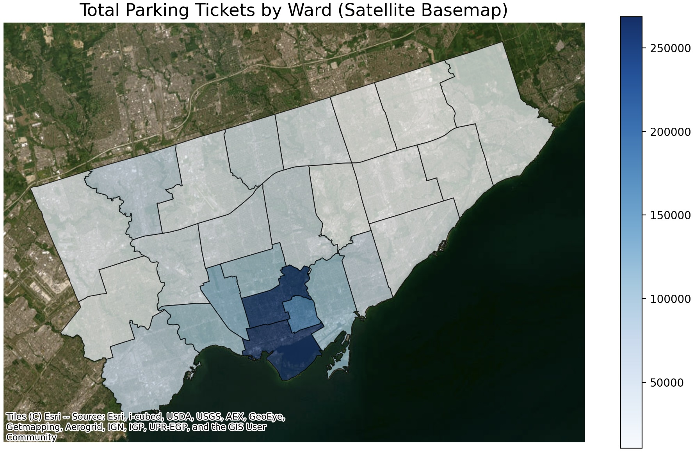  
**Figure 1.1:** Map of the total number of parking tickets issued in each ward in Toronto during 2024

The wards with the highest concentration of tickets issued are Spadina-Fort York, Toronto Centre, and University-Rosedale. These three wards primarily cover the downtown core. Downtown is where traffic volume, commercial density, and parking enforcement are the highest. Parking is very scarce in this area of Toronto, making it likely for more people to park in restricted areas. The map also illustrates how the number of tickets in each ward decreases the further it is from the downtown core.  
    
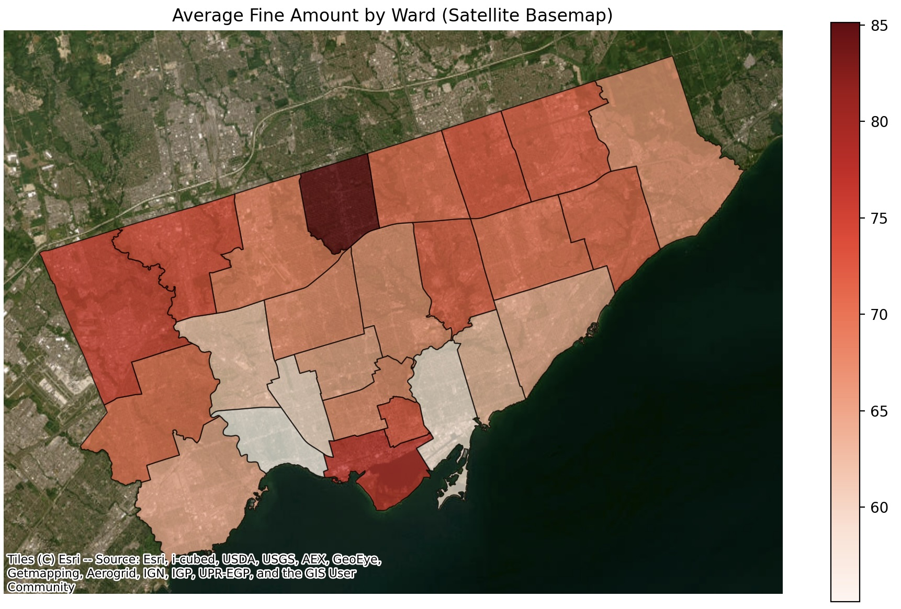  
**Figure 1.2:** Map of the average fine amount for each ward in the City of Toronto in 2024

The ward with the highest average fine amount is Willowdale, while the remaining wards are much closer in average fine amounts. A higher average fine indicates that a larger proportion of high value violations are being issued in that ward.

Both maps demonstrate that there is no positive correlation between the total number of tickets issued and the severity of the fines. Downtown wards issue the highest volume of tickets issued, yet their average fine amounts are relatively low. The most common infraction type downtown involves parking machine violations, such as unpaid fees, expired receipts, or permits not displayed correctly. These kinds of infractions are generally lower fines, but given in higher volumes.  
In contrast, Willowdale issues fewer tickets, but a high number of high value tickets are issued. The most common infraction in this ward includes rush-hour violations, No-stopping zones, and transit stop standing, which all have much higher penalties. Willowdale’s infractions are skewed to being more high-value tickets.

### 1.3.2 Spread in fines issued per ward

  
**Figure 1.3:** Box plots of the fine amounts for each ticket issued in each ward

This boxplot showcases that the spread in fine amounts differs drastically amongst the wards. Some wards have a tighter cluster of fines, indicating the fines given are more close in value, some wards have a large spread, meaning that a wider variety of infraction types are given in these wards.   
	

### 1.3.3 Per ward summary statistics

**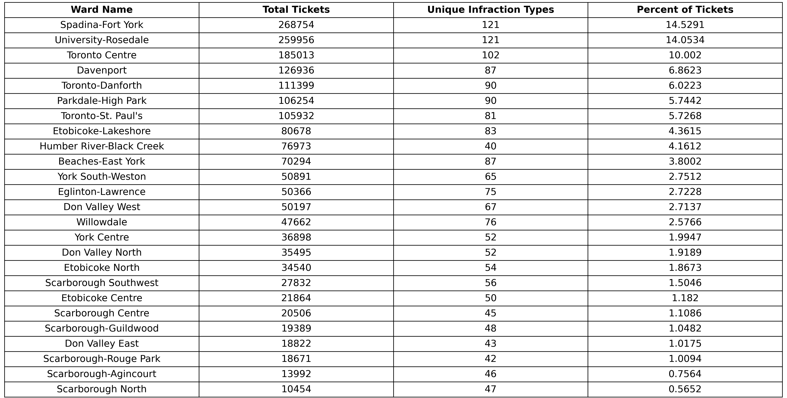**  
**Figure 1.4:** Summary Statistics (1/2) including total counts, unique infraction types, and proportion of city wide tickets  
**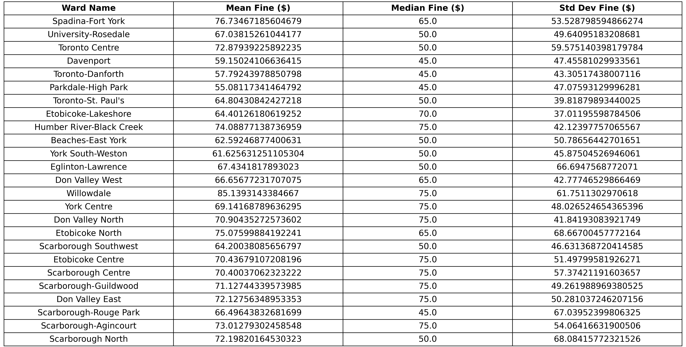**  
**Figure 1.5:** Summary Statistics (2/2) including the Mean, median and standard deviation of fines within each ward

## 1.4 Statistical Tests

### 1.4.1 Do some wards have more tickets issued than expected?

Chi-squared setup:  
	  
**Null hypothesis (H₀):**  
	Infraction type is independent of ward

A chi-square test of independence is performed to examine whether the distribution of infraction types differs across Toronto’s wards. The test resulted in the following values: 

- χ² \= 1,537,793   
- df \= 3792  
- p \< 0.001

These results indicate that there is a significant association between wards and the types of parking infractions. This indicates the types of parking infractions differ substantially between each ward. There is no uniformity of infraction types amongst the wards, with certain wards issuing different mixes of infraction types.

### 1.4.2 Does the mean fine amount differ among the awards

One-way ANOVA setup:

**Null hypothesis (H₀):**  
	The mean parking fine amount is the same across all Toronto wards.  
**Alternative hypothesis (H₁):**  
	At least one ward has a different mean fine amount.

Performing a one-way ANOVA test to determine whether the mean fine amount differing produces the following results:

- F(24, 1,849,743) \= 1479.81  
- p \< 0.001  
- Model sum of squares: 9.14 × 10⁷  
- Residual sum of squares: 4.76 × 10⁹

These results indicate that the average fine amount is not the same across wards, the fine amounts differ by region. This also indicates that some wards issue significantly more high value fines than others. Therefore the level and degree of enforcement varies across the city. 

<div style="page-break-after: always"></div>

# **2\. Seasonality and Time**

## 2.1. Introduction

It is reasonable to assume that parking behaviour and enforcement varies over time. Seasonal weather conditions can influence travel patterns, residential parking may fluctuate throughout the year, and daily mobility cycles create predictable surges in demand during peak daylight hours. These temporal factors suggest that parking infractions, and the ticket fines associated, may follow discernible patterns rather than occurring uniformly throughout a year. Understanding temporal patterns in ticketing, specifically in how infractions vary by season, month, and the hour of day, can inform both municipal enforcement strategies and broader traffic policies. If such strong temporal cycles exist, they may reveal structural pressures in parking demand or periods where enforcement resources are disproportionately strained.   
This raises an investigative study on the extent that parking tickets correlate with temporal variables, or more specifically, whether the fine amounts or the frequency of tickets correlate best with temporal variables. To address this question, we use a regression model to evaluate whether the total number of infractions is statistically associated with these temporal predictors. This approach allows us to quantify whether parking behaviour and enforcement activity exhibit systematic, predictable cycles, or whether the observed variation in ticketing is largely stochastic.

## 2.2 Methodology

Temporal variables were derived from the existing *date\_of\_infraction* and *time\_of\_infraction* fields. Specifically, season was recoded based on the month of infraction (spring: March-May, summer: June-August, fall: September-November, winter: December-February), month was extracted directly from the date, and hour was obtained from the time of infraction.  
Tickets were aggregated across these temporal dimensions to create a dataset of ticket counts. The dependent variable in the analysis was *ticket\_count*, representing the number of tickets per aggregation unit, while the independent variables were *season*, *month*, and *hour*. This structure allowed for examination of whether ticket issuance exhibited systematic variation according to seasonality, monthly trends, and daily cycles.  
For inferential analysis, a Poisson regression model was employed using Python’s statsmodels library. This approach is appropriate for count data and models the relationship between ticket counts and temporal predictors while accounting for the non-negative and discrete nature of the dependent variable. Coefficients were interpreted as log-rate changes in ticket counts relative to reference categories.

## 2.3 Results

Before performing regression analyses, we examined the aggregate characteristics of parking infractions across season, month, and hour. The dataset included over 2 million parking infractions aggregated across multiple years, seasons, months, and hours of day. Initial descriptive analyses revealed clear temporal variation in ticketing patterns. To formally assess whether ticket counts were associated with temporal variables, a Poisson regression model was fit with season, month, and hour of day as predictors.

### 2.3.1 Seasonal summary 

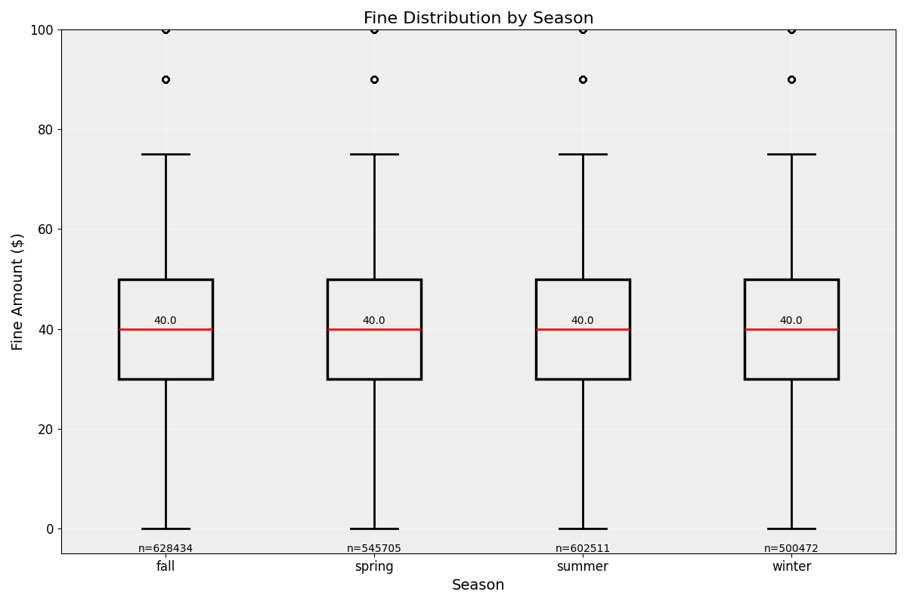  
**Figure 2.1:** Fine amount distribution by season.

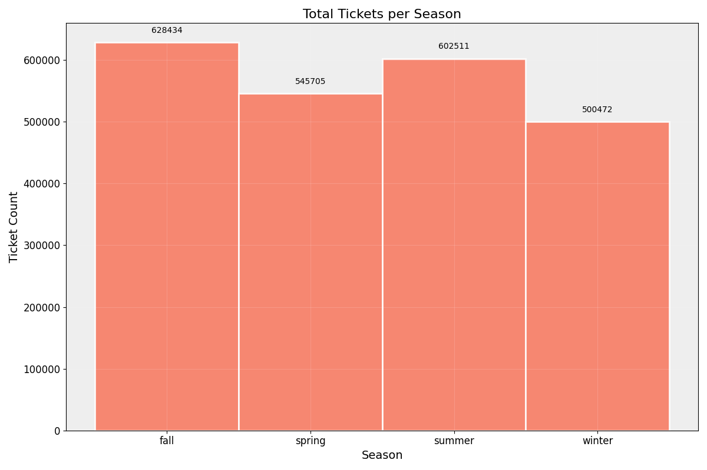  
**Figure 2.2:** Ticket frequency by season.

The total number of parking tickets varied across seasons, with fall accounting for the largest share of infractions (593,182 tickets, 27.97% of the marginal annual total) and winter the fewest (462,342 tickets, 21.81% marginal). Summer and spring accounted for approximately 27% and 24% of the tickets, respectively. The mean set fine per infraction was relatively consistent across seasons, ranging from $46.18 in spring to $46.52 in fall, with a standard deviation of $0.15, indicating minimal variation in fines. The most frequent infraction type in all seasons was parking in a signed prohibited area, comprising 62,129 tickets in winter and 98,924 tickets in summer, which highlights a consistent enforcement focus on highway-signed parking violations. Overall, while ticket counts showed clear seasonal differences, the fine amounts themselves were stable, suggesting that changes in infraction frequency rather than fine policies drive seasonal variation.

The distribution of infractions by season can also be observed through conditional percentages for each season within each year. 

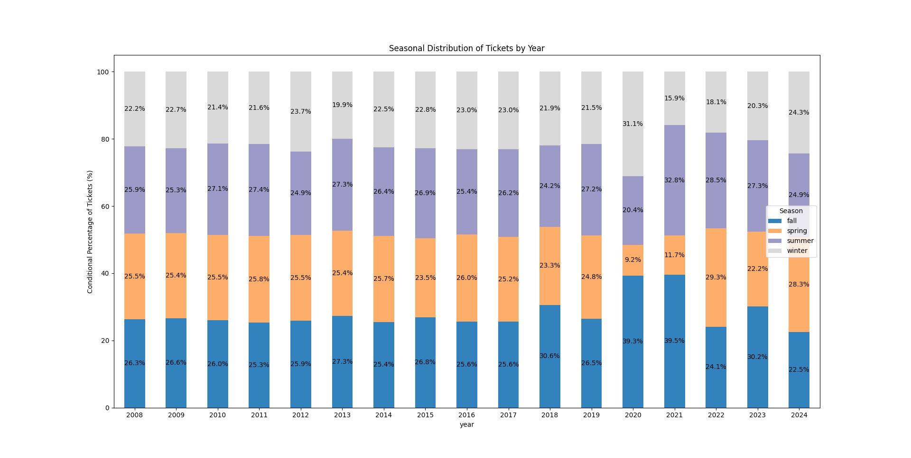  
**Figure 2.3:** Conditional percentages of tickets by season for 2008-2024.

Across the 2008-2024 period, the seasonal distribution of tickets is generally consistent with the overall marginal percentages (Figure 2.2), with fall and summer accounting for the largest share of tickets, and winter the smallest. Exceptions occur during 2020 and 2021, likely reflecting pandemic-related changes, where the frequency of infractions increased in fall  (\~39%), and spring tickets dropped sharply to about 9-12%. 

Overall, ticket counts show clear seasonal variation, with fall and summer consistently accounting for the largest frequencies. In contrast, average and median fine amounts remain relatively uniform across seasons. 

### 2.3.2 Monthly summary

Monthly ticket counts gradually increase from February (140,374 tickets, 6.6% of the annual total) to a peak in October (204,337 tickets, 9.6%), suggesting that parking infractions rise in the autumn months before declining slightly in November and December.  
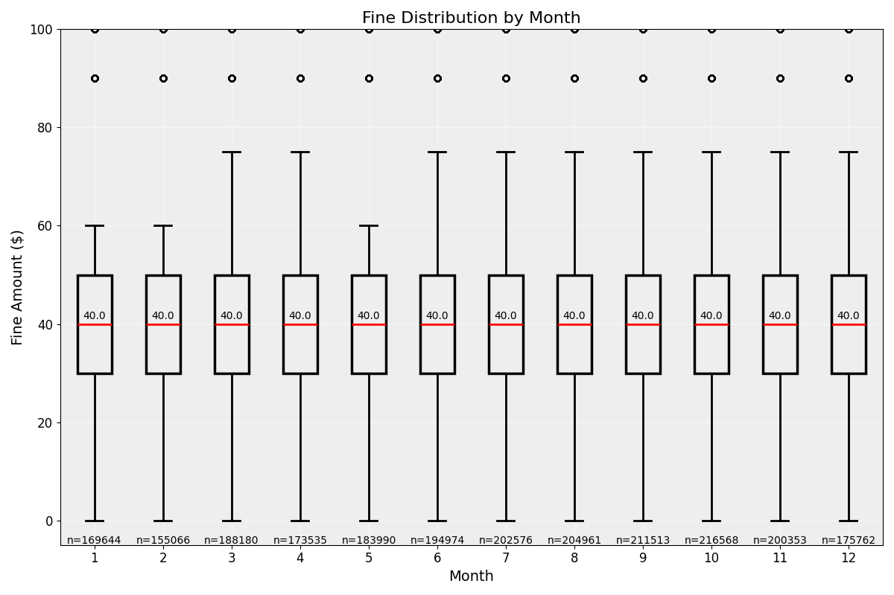  
**Figure 2.4:** Fine amount distribution by month.

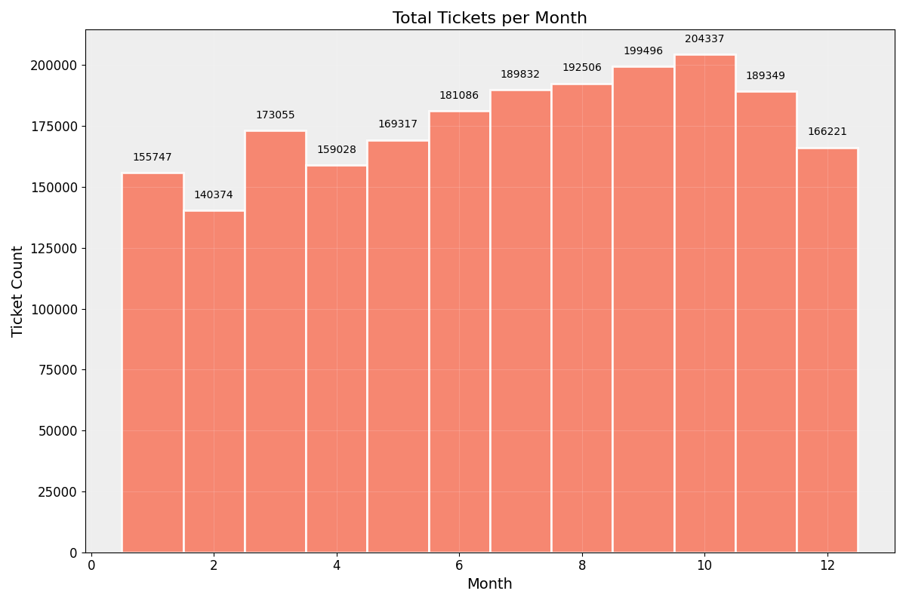  
**Figure 2.5:** Ticket frequency by month.  
Mean fines remained relatively stable across the year, ranging from $45.87 to $46.72 (SD ≈ $0.27), indicating consistent enforcement levels in terms of fine amounts. Across most months, the top infraction was parking in a prohibited area during the daytime, particularly dominant from March to November, whereas parking in a prohibited area without a permit was most common in January and April. These results indicate that seasonal and monthly patterns in ticket counts are primarily driven by fluctuations in infraction occurrence rather than changes in fine amounts.

### 2.3.3 Hourly summary

Examining ticket counts and fines by hour of day reveals a clear diurnal pattern (Figure 2.6, Figure 2.7). The fewest tickets are issued during the early morning hours of 5-7 AM (11,022-52,745 tickets, 0.5-2.5% of the total daily tickets), whereas ticketing peaks between 9 AM and 1 PM (136,374-160,435 tickets, 6.4-7.5% of daily total), indicating concentrated enforcement during typical commuting hours. Late evening hours, particularly 10 PM-11 PM, also show elevated ticket counts relative to early morning. Mean fines similarly vary throughout the day, with higher fines observed during peak commuting hours at approximately 50-55 CAD between 7-10 AM and 2-4 PM, while the lowest fines occur during early morning hours (30-39 CAD between 0-6 AM). This pattern suggests that both the frequency of infractions and corresponding enforcement intensity follow predictable daily cycles, likely reflecting traffic flow, parking demand, and municipal enforcement scheduling.

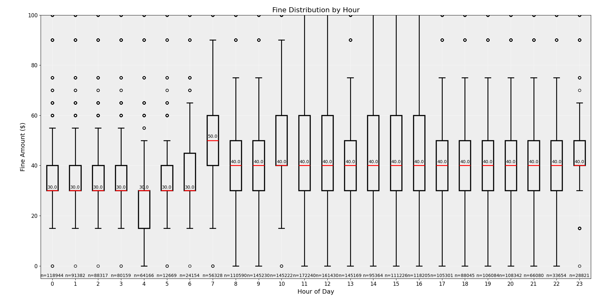  
**Figure 2.6:** Fine amount distribution by hour of day.

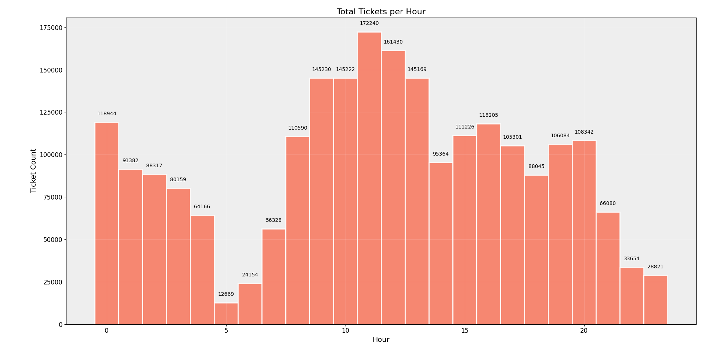  
**Figure 2.7:** Ticket frequency by hour of day.

### 2.3.4 Regression Methodology

From the summary statistics, the mean fine amount does not vary significantly across the three temporal variables. However, the overall ticket count (*ticket\_count*) appears to vary most significantly by the three temporal variables. This would suggest that the number of tickets issued is strongly dependent on time. A model such as regression would formally quantify the temporal effects and test whether observed variations in ticket counts are statistically significant.

Since the outcome of interest is a discrete variable, we employ Poisson regression, a standard generalized linear model for count data. Poisson regression assumes that the log of the expected count is a linear function of the predictors, where:

log(E(Y)) \= β<sub>0</sub>+β<sub>1</sub>X<sub>1</sub>+β<sub>2</sub>X<sub>2</sub>+ ...

* Y \= the daily or aggregated ticket count,  
* X<sub>1</sub>,X<sub>2</sub>, ... \= temporal predictors (season, month, hour).

To perform this analysis, tickets were aggregated by season, month, and hour depending on the model. We then fit a Poisson regression of the form: ticket\_count \~ C(season) \+ month \+ hour. The baselines for each temporal variable are fixed to the fall season, January (month 1), and midnight (hour 0\) respectively. This approach provides coefficient estimates, significance tests, and goodness-of-fit metrics that indicate whether temporal variables explain observed variation in infraction counts.

### 2.3.5 Regression Analysis
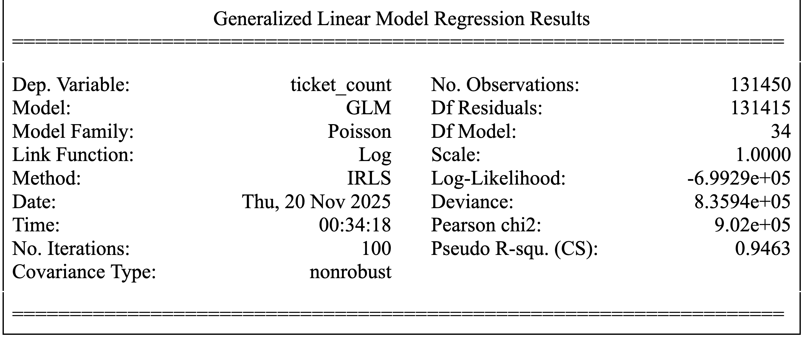
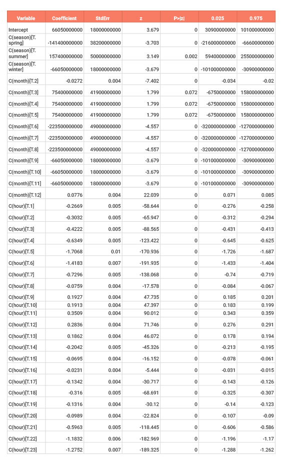

<!-- | Generalized Linear Model Regression Results \=================================================================== |  |  |  |  |
| ----- | ----: | :---- | :---- | ----: |
| Dep. Variable:                Model:                                      Model Family:                 Link Function:                             Method:                                      Date:                     Time:                           No. Iterations:                      Covariance Type:             | ticket\_count  GLM Poisson   Log    IRLS Thu, 20 Nov 2025 00:34:18 100  nonrobust |  | No. Observations: Df Residuals: Df Model:  Scale: Log-Likelihood: Deviance: Pearson chi2: Pseudo R-squ. (CS):  | 131450                       131415                                     34                                   1.0000           \-6.9929e+05                     8.3594e+05                   9.02e+05 0.9463 |
| \=================================================================== |  |  |  |  |

| Variable | Coefficient | StdErr | z | P\>|z| | 0.025 | 0.975 |
| ----- | ----- | ----- | ----- | ----- | ----- | ----- |
| Intercept | 66050000000 | 18000000000 | 3.679 | 0 | 30900000000 | 101000000000 |
| C(season)\[T.spring\] | \-141400000000 | 38200000000 | \-3.703 | 0 | \-216000000000 | \-66600000000 |
| C(season)\[T.summer\] | 157400000000 | 50000000000 | 3.149 | 0.002 | 59400000000 | 255000000000 |
| C(season)\[T.winter\] | \-66050000000 | 18000000000 | \-3.679 | 0 | \-101000000000 | \-30900000000 |
| C(month)\[T.2\] | \-0.0272 | 0.004 | \-7.402 | 0 | \-0.034 | \-0.02 |
| C(month)\[T.3\] | 75400000000 | 41900000000 | 1.799 | 0.072 | \-6750000000 | 158000000000 |
| C(month)\[T.4\] | 75400000000 | 41900000000 | 1.799 | 0.072 | \-6750000000 | 158000000000 |
| C(month)\[T.5\] | 75400000000 | 41900000000 | 1.799 | 0.072 | \-6750000000 | 158000000000 |
| C(month)\[T.6\] | \-223500000000 | 49000000000 | \-4.557 | 0 | \-320000000000 | \-127000000000 |
| C(month)\[T.7\] | \-223500000000 | 49000000000 | \-4.557 | 0 | \-320000000000 | \-127000000000 |
| C(month)\[T.8\] | \-223500000000 | 49000000000 | \-4.557 | 0 | \-320000000000 | \-127000000000 |
| C(month)\[T.9\] | \-66050000000 | 18000000000 | \-3.679 | 0 | \-101000000000 | \-30900000000 |
| C(month)\[T.10\] | \-66050000000 | 18000000000 | \-3.679 | 0 | \-101000000000 | \-30900000000 |
| C(month)\[T.11\] | \-66050000000 | 18000000000 | \-3.679 | 0 | \-101000000000 | \-30900000000 |
| C(month)\[T.12\] | 0.0776 | 0.004 | 22.039 | 0 | 0.071 | 0.085 |
| C(hour)\[T.1\] | \-0.2669 | 0.005 | \-58.644 | 0 | \-0.276 | \-0.258 |
| C(hour)\[T.2\] | \-0.3032 | 0.005 | \-65.947 | 0 | \-0.312 | \-0.294 |
| C(hour)\[T.3\] | \-0.4222 | 0.005 | \-88.565 | 0 | \-0.431 | \-0.413 |
| C(hour)\[T.4\] | \-0.6349 | 0.005 | \-123.422 | 0 | \-0.645 | \-0.625 |
| C(hour)\[T.5\] | \-1.7068 | 0.01 | \-170.936 | 0 | \-1.726 | \-1.687 |
| C(hour)\[T.6\] | \-1.4183 | 0.007 | \-191.935 | 0 | \-1.433 | \-1.404 |
| C(hour)\[T.7\] | \-0.7296 | 0.005 | \-138.068 | 0 | \-0.74 | \-0.719 |
| C(hour)\[T.8\] | \-0.0759 | 0.004 | \-17.578 | 0 | \-0.084 | \-0.067 |
| C(hour)\[T.9\] | 0.1927 | 0.004 | 47.735 | 0 | 0.185 | 0.201 |
| C(hour)\[T.10\] | 0.1913 | 0.004 | 47.397 | 0 | 0.183 | 0.199 |
| C(hour)\[T.11\] | 0.3509 | 0.004 | 90.012 | 0 | 0.343 | 0.359 |
| C(hour)\[T.12\] | 0.2836 | 0.004 | 71.746 | 0 | 0.276 | 0.291 |
| C(hour)\[T.13\] | 0.1862 | 0.004 | 46.072 | 0 | 0.178 | 0.194 |
| C(hour)\[T.14\] | \-0.2042 | 0.005 | \-45.326 | 0 | \-0.213 | \-0.195 |
| C(hour)\[T.15\] | \-0.0695 | 0.004 | \-16.152 | 0 | \-0.078 | \-0.061 |
| C(hour)\[T.16\] | \-0.0231 | 0.004 | \-5.444 | 0 | \-0.031 | \-0.015 |
| C(hour)\[T.17\] | \-0.1342 | 0.004 | \-30.717 | 0 | \-0.143 | \-0.126 |
| C(hour)\[T.18\] | \-0.316 | 0.005 | \-68.691 | 0 | \-0.325 | \-0.307 |
| C(hour)\[T.19\] | \-0.1316 | 0.004 | \-30.12 | 0 | \-0.14 | \-0.123 |
| C(hour)\[T.20\] | \-0.0989 | 0.004 | \-22.824 | 0 | \-0.107 | \-0.09 |
| C(hour)\[T.21\] | \-0.5963 | 0.005 | \-118.445 | 0 | \-0.606 | \-0.586 |
| C(hour)\[T.22\] | \-1.1832 | 0.006 | \-182.969 | 0 | \-1.196 | \-1.17 |
| C(hour)\[T.23\] | \-1.2752 | 0.007 | \-189.325 | 0 | \-1.288 | \-1.262 | -->

The regression results indicate that temporal variables significantly influence the number of parking infractions. Seasonality was a strong predictor: relative to the baseline category (fall), spring exhibited a significant negative effect on ticket counts (β \= \-1.41 × 10¹¹, p \< 0.001), while summer showed a significant positive effect (β \= 1.57 × 10¹¹, p \= 0.002). Winter was associated with a significant reduction in ticketing compared to fall (β \= \-6.61 × 10¹⁰, p \< 0.001). These results suggest that ticketing activity fluctuates systematically with the seasons. Winter indicates the least amount of issued tickets, reasonably due to weather conditions.  
Monthly effects showed more nuanced variation. Several mid-year months (June–August) were associated with significantly lower ticket counts, while December exhibited a positive effect (β \= 0.0776, p \< 0.001). This is likely due to the regression baseline set in January, and so months within the same season would have better correlation. This indicates a tendency for ticketing to vary over the calendar year, potentially linked to seasonal traffic flows or enforcement schedules. It would thus be reasonable to suggest that infractions occur more frequently during the start of the school year and peak commuting season.  
Hourly effects revealed significant daily cycles in ticket issuance. Early morning hours (1:00–6:00) were generally associated with lower counts, with the largest reductions observed around 5:00 (β \= \-1.71, p \< 0.001) and 6:00 (β \= \-1.42, p \< 0.001). Ticket counts increased during late morning and midday hours, peaking around 11:00–12:00 (β \= 0.35, p \< 0.001 and β \= 0.28, p \< 0.001, respectively), before gradually decreasing during the late afternoon and evening, reaching the lowest values again around 11pm (β \= \-1.28, p \< 0.001). These hourly patterns suggest systematic enforcement activity or parking demand fluctuations throughout the day, reasonably due to enforcement officer schedules and peak work or school hours.

Overall, the model exhibited a high degree of fit for count data, with a pseudo R² of 0.9463, indicating that the seasonal, monthly, and hourly predictors collectively explain a substantial proportion of the variance in parking ticket counts. The results suggest that the number of parking tickets varies depending on the time of year, month, and hour of day. Parking infractions are most likely issued during the fall season in October during the morning and mid-day hours, and least likely during winter months around late evening or early morning hours. This is likely due to most enforcement officers typically scheduled to work during the day, and the starting school commute season in September and October. 

<div style="page-break-after: always"></div>

# **3\. Infraction Types**

The core of this section is to categorise parking tickets by different types of infraction, and then use these categories to explore various questions. For example:

1. For each type of infraction, how many tickets does Toronto issue on average per year? Which are the top 10 and bottom 10?  
2. In 2008, what were the top 10 infraction types? What about in 2024? Did parking enforcement patterns change between 2008 and 2024?

## 3.1 Average Tickets Issued by Infraction Types

There are in total 594 different types of infractions being issued. Below is a table of the top 10 and bottom 10 most common tickets issued on average per year. Based on these two tables, we can clearly see that different types of violations show quite significant differences in the number of tickets issued. However, based on this table alone, we cannot say with certainty that there is a difference. But later, we will use a chi-squared test to further demonstrate that such a difference does exist.

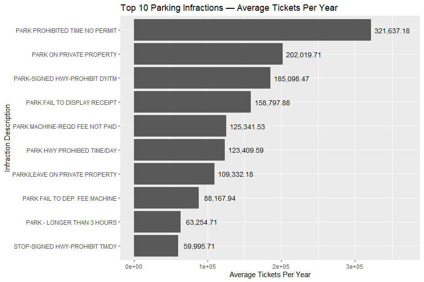  
**Figure 3.1.1**

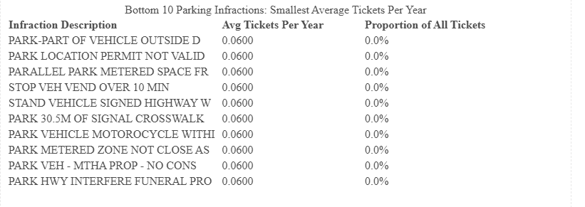  
**Figure 3.1.2**

From Figure 3.1.1 and Figure 3.1.3, we can see that the top 10 issued infractions represent a very large share of all tickets issued.The top 10 infraction types together account for 69.5% of total enforcement activity, while the majority of other violation types occur far less frequently.

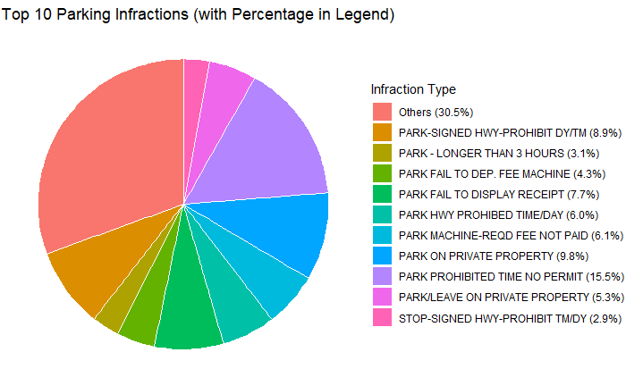  
**Figure 3.1.3**

## 3.2 Top 10 Infraction Types in 2008 and 2024

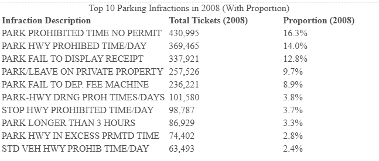  
**Figure 3.2.1**

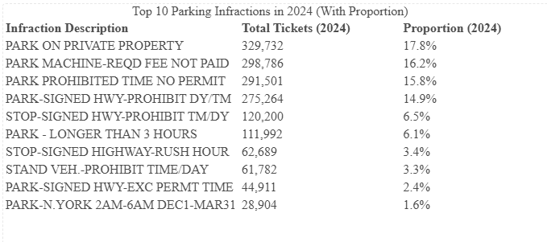  
**Figure 3.2.2** 

**Seven out of ten** of the top 10 parking infractions from 2008 and 2024 are the same, and these includes:

* PARK PROHIBITED TIME NO PERMIT  
* PARK HWY PROHIBITED TIME/DAY (shown as PARK-SIGNED HWY-PROHIBIT DY/TM on Figure 3.2.2)  
* PARK/LEAVE ON PRIVATE PROPERTY (shown as PARK ON PRIVATE PROPERTY in Figure 3.2.2)  
* PARK FAIL TO DEP. FEE MACHINE (shown as PARK MACHINE-REQD FEE NOT PAID in Figure 3.2.2)  
* STOP HWY PROHIBITED TIME/DAY (shown as STOP-SIGNED HWY-PROHIBIT DY/TM in Figure 3.2.2)  
* PARK LONGER THAN 3 HOURS (shown as PARK \- LONGER THAN 3 HOURS in Figure 3.2.2)  
* PARK HWY IN EXCESS PRMTD TIME (shown as PARK-SIGNED HIGHWAY-EXC PERMIT TIME in Figure 3.2.2)

From these two tables, we can see that over the past nearly 20 years, the violations with the highest number of tickets have remained almost the same. However, the actual number of tickets given for each infraction and its proportion are relatively inconsistent. This makes it hard to conclude if there is an actual change in the distribution of tickets between 2008 and 2024\.  
Note that names are shown differently for 2008 and 2024, this might be due to the fact that because the City of Toronto changed the official wording of those parking infraction descriptions between 2008 and 2024\. It is also worth mentioning that HWY does not only apply to highways in this dataset, it represents all roadways.

### Chi-Squared Test

In order to further verify whether parking tickets issued in 2008 are significantly different from 2024, we will now compute the chi-squared test. The **null hypothesis** being: The distribution of parking infraction types in 2008 is the same as the distribution of parking infraction types in 2024\.  
In order to compute the chi-squared test. We first need R to sum up the total tickets issued in 2008 and 2024 for each infraction. Then using these numbers, we can then proceed with the test.

The chi-square test comparing infraction distributions between 2008 and 2024 shows:

* X² \= 3,628,785,  
* df \= 464,  
* p \< 2.2e-16 ≈ 0

With the above results, we can confidently say that **the infraction distribution between 2008 is significantly different from 2024\.**

Flaws of this statistic result:  
After reaching this step, I realised that there is a huge flaw to the test computed above. As we can see from Figure 3.2.1 and 3.2.2, the names of the infractions have changed over the time period. When comparing results from the table, we can easily identify which ones are the same. However, when R is computing these results, it treats them as different things. For instance, we can clearly see that PARK LONGER THAN 3 HOURS indicates the same infraction as PARK \- LONGER THAN 3 HOURS, but R will treat them as two different infractions. This makes the chi-squared test result above extremely unreliable. 

In order to overcome this flaw, we will compute the chi-squared test again using the indicated infraction code instead of the infraction description. However, one assumption needs to be made. We need to assume that the infraction code remains the same throughout the years (i.e., “9” will always mean STOP HWY PROHIBITED TIME/DAY in both 2008 and 2024\)

Chi-Squared by Infraction code result:

*  X² \= 622,550   
* df \= 220    
* p \< 2.2e-16

The degree of freedom changed from 464 to 220, the degrees of freedom were reduced by more than half, which means that in the previous test, R essentially separated almost all infraction types between 2008 and 2024 into distinct categories. This greatly explains why the chi-squared value ended up being so large.  
However, even with the new results, we can still come to the same conclusion: **the infraction distribution between 2008 is significantly different from 2024\.**

<div style="page-break-after: always"></div>

# **4\. Location and other influencing characteristics**

## 4.1. Introduction 

Parking enforcement in Toronto operates within a highly diverse urban environment. The city contains dense commercial districts, major institutional campuses, arterial road networks, and residential neighbourhoods, each with distinct patterns of parking demand, mobility pressures, and regulatory constraints. These structural differences suggest that both where a ticket is issued and what type of violation occurs may strongly influence the number of tickets issued and the fines associated with them.

This section investigates whether location and other ticket characteristics meaningfully affect both (i) ticket volume and (ii) average fine amounts, using detailed longitudinal data spanning 2008--2024. Our analysis draws on yearly ticket totals, location-level aggregates, fine distributions, and inferential statistical tests. Beyond descriptive summaries, we interpret results through the lens of Toronto's geography; identifying which local hotspots dominate ticketing activity, and how neighbourhood characteristics, land use, and enforcement patterns shape these outcomes.

Overall, we find substantial spatial variation in both the frequency and severity of parking infractions, and strong evidence that location is one of the most influential predictors of how parking violations occur across the city.

## 4.2. Descriptive Analysis

Ticket issuance in Toronto has fluctuated considerably over the past 17 years. Annual totals range from a high of approximately 2.87 million tickets in 2008 to a low of about 1.40 million tickets in 2020, coinciding with reduced mobility during the COVID--19 pandemic. Ticket counts have since rebounded, reaching around 2.15 million in 2024\. These totals suggest that parking enforcement responds not only to bylaw constraints but also to broader societal and economic conditions. Sudden decreases in 2020--2021 reflect citywide mobility restrictions, while the post-pandemic rebound reflects a return toward pre-COVID traffic patterns.

### 4.2.1 Summary Statistics

The dataset spans more than 40 million parking tickets and includes timestamps, locations, fine amounts, infraction types, and ward-level geographic identifiers. Ticket counts and location--year aggregates were computed for all 17 years.

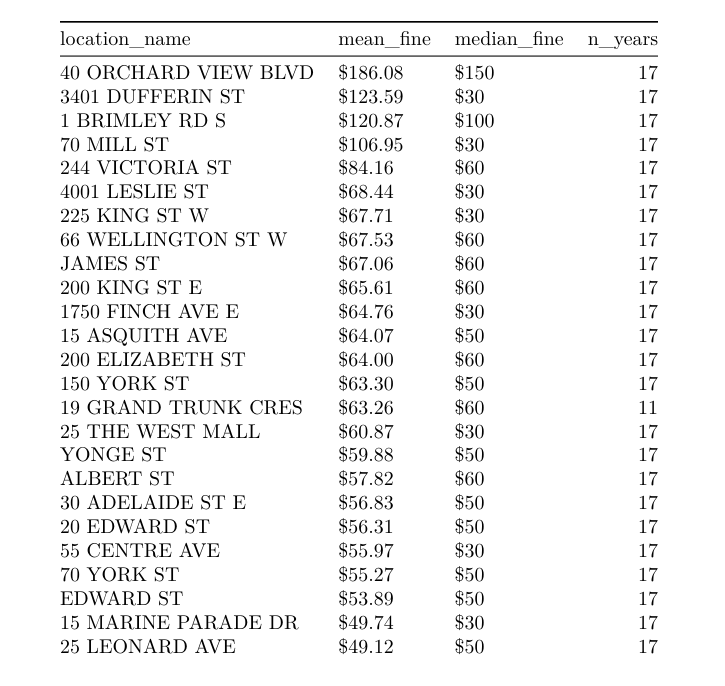  
**Figure 4.1**: Summary statistics table for ticket frequencies and fines

## 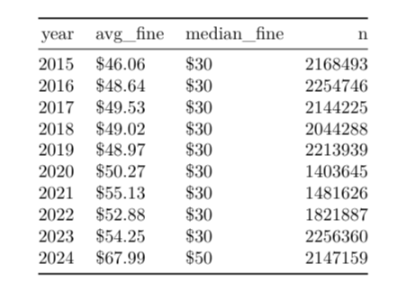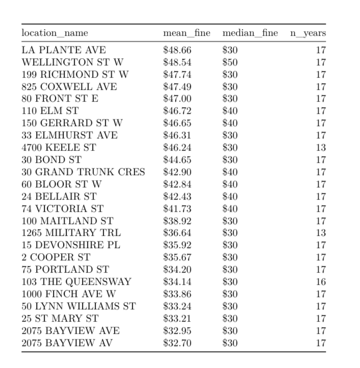

**Figure 4.2**: Additional distributions and introductory plots

## 4.3. Locations With the Highest Cumulative Ticket Counts

A small set of locations accounts for a disproportionately large share of all parking tickets issued across the city. Based on cumulative counts across all years, the most ticketed locations include

* 4700 Keele St (York University area),  
* 2075 Bayview Ave (Sunnybrook Hospital),  
* 20 Edward St (Eaton Centre / Yonge--Dundas area),  
* 1750 Finch Ave E (major arterial corridor), and  
* James St (adjacent to central downtown retail corridors).

These addresses correspond to major institutional or commercial nodes with intensive activity. They combine high parking demand, heavy foot and vehicle traffic, strict curb regulations, and limited availability of legal short-duration parking, all of which contribute to elevated enforcement activity.

Within each year, a small number of these locations consistently represent large shares of the tickets among the top-10 hotspots. For instance, in some years a single location such as 1750 Finch Ave E accounts for more than 30% of tickets within the top-10 set. This ‘hotspot’ behaviour indicates that enforcement is not evenly distributed across all neighbourhoods but instead focuses on select corridors with persistent regulatory challenges.

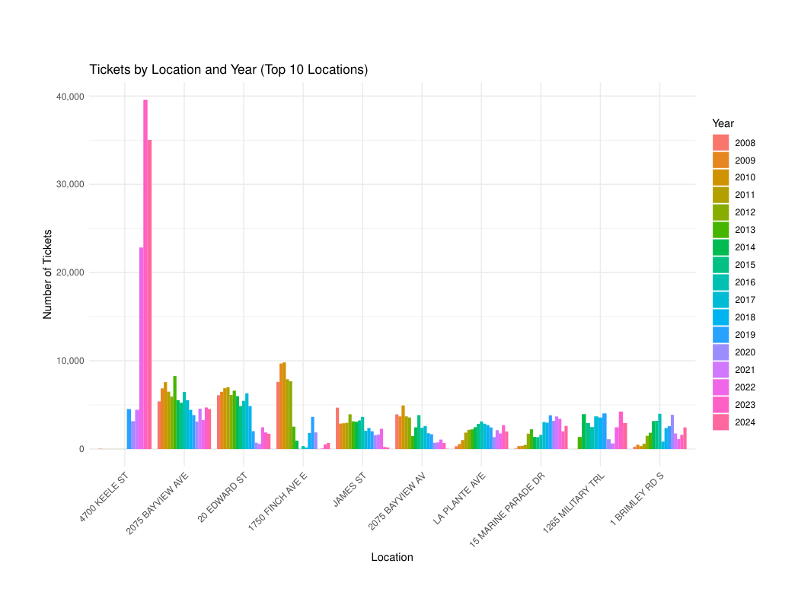  
**Figure 4.3**: Tickets by location and year for the top 10 enforcement hotspots in Toronto (2008--2024).

## 4.4. Fine Amounts Across Years

Average fine amounts have risen steadily over time. In 2008, the mean fine was approximately $38.85, increasing to around $50.27 by 2020 and reaching $67.99 by 2024\. For most of the period, the median fine remained stable at $30, before increasing to $50 in 2024\. This upward trend likely reflects updates to the City of Toronto's penalty schedules, inflationary adjustments, and the introduction of higher-value fines for priority offences (for example, stopping in transit zones or blocking bike lanes).

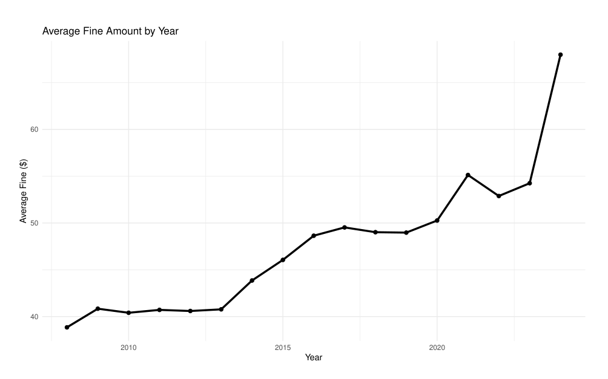  
**Figure 4.4**: Trend in average fine amounts issued in Toronto from 2008--2024.

The sharp rise in both mean and median fines in the final years of the dataset suggests a policy shift toward more substantial penalties, particularly in 2024\.

## 4.5. Locations With the Highest Average Fines

While central locations dominate ticket volumes, they do not necessarily dominate average fines. Instead, the highest average fine amounts are observed at locations associated with more serious or high-risk violations. Examples include:

* 40 Orchard View Blvd,  
* 3401 Dufferin St,  
* 1 Brimley Rd S, and  
* 70 Mill St.

These areas are often near high-demand commercial or institutional sites where infractions may involve fire routes, loading zones, or critical access points rather than minor metered violations. As a result, these locations exhibit substantially higher mean fines, even if they do not issue the largest number of tickets.

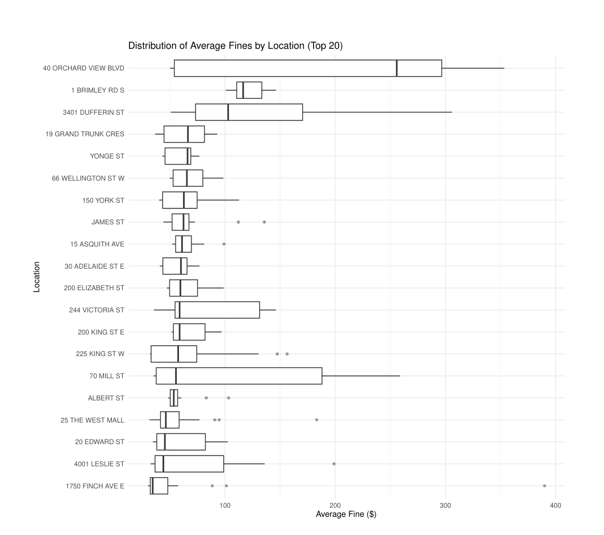  
**Figure 4.5**: Distribution of yearly average fines for the 20 highest-fine locations in Toronto.

This contrast illustrates an important pattern: high-volume locations tend to issue a large number of lower-fine infractions (such as expired meters or permit issues), whereas high-fine locations specialize in more severe offences issued less frequently.

**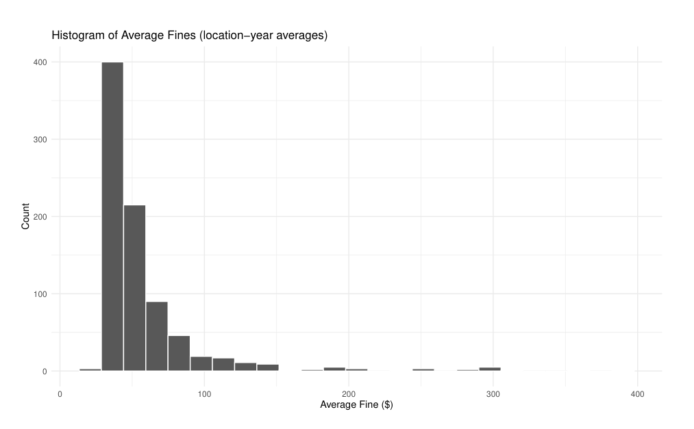**

**Figure 4.6:** Histogram of average fines across all location--year observations.

Beyond the highest-fine sites, the citywide distribution of location-level average fines shows a wide range of values, with a concentration of locations around moderate fine levels and a long right tail of locations where fines are substantially higher.

## 4.6 Statistical Tests of Association

The descriptive patterns above suggest strong spatial and temporal structure in ticketing. To formally assess whether these differences are statistically significant, we apply several inferential methods.

### 4.6.1 ANOVA: Do Fines Differ Across Years? 

We first fit an ANOVA model with average fine as the response and year as a categorical predictor. The model tests whether mean fines are equal across years. The F-statistic is approximately 5.34 with a corresponding p-value of 7.55 x 10-11, providing strong evidence against the null hypothesis of equal mean fines across years.  
This result is consistent with the upward trend observed in Figure 4.4: fines have changed significantly over time, reflecting policy updates, inflation and shifts in enforcement priorities.

### 4.6.2 Kruskal--Wallis Test: Do Fines Differ Across Locations? 

To examine spatial differences, we apply a Kruskal--Wallis rank-sum test, comparing average fines across locations. The test statistic is approximately 2 \= 463 with 49 degrees of freedom and a p-value of 1.09 x10-86. This extremely small p-value indicates that fine levels vary substantially across locations.

This finding reinforces the visual evidence from Figures 4.5 and 4.6; some locations systematically issue higher-fine violations than others, in line with their local land use, traffic intensity and types of restrictions in place.

### 4.6.3 Two-Way Linear Model: Fine  Year \+ Location

We next fit a two-way linear model with average fine as the outcome and both year and location as categorical predictors. The model explains about 52% of the variance in average fines ^20.524, with an overall p-value on the order of 10-86. Both year and location are highly significant.

Even after adjusting for the year, location remains an important predictor of average fines. This indicates that spatial variation in fine levels cannot be explained solely by changes over time; instead, it reflects persistent differences in enforcement environments across specific parts of the city.

### 4.6.4 Chi-Square Test: Ticket Counts by Location and Year

Finally, we examine whether ticket counts are associated with location and year jointly. Using a contingency table of ticket counts for the top ten locations across years, a chi-square test yields a statistic of approximately 426,364 with 144 degrees of freedom and a p-value effectively equal to zero.

This result suggests that the distribution of ticket counts across locations changes significantly over time. Some locations become more prominent as enforcement hotspots in particular years, while others decline, consistent with changes in land use, construction activity, institutional operations and evolving enforcement focus.

## 4.7 Interpretation and Discussion

The combined descriptive and inferential results indicate that location is one of the strongest determinants of both how many tickets are issued and how severe they are. Several themes emerge:

1. **Ticketing is highly spatially concentrated:** A small number of addresses---especially around York University, Sunnybrook Hospital and the downtown core---consistently account for a large share of total tickets. These locations experience high parking demand, limited curb space and strict regulations, leading to more frequent enforcement.  
2. **High-fine locations reflect more severe offences:** Sites such as Orchard View Blvd, Dufferin St and Brimley Rd S exhibit high average fines because the underlying violations tend to involve more serious infractions, such as blocking fire routes, loading docks or transit-related zones, rather than minor overstay at meters.  
3. **Temporal patterns interact with location:** The chi-square results indicate that enforcement hotspots shift over time. For example, some locations such as 4700 Keele St show notable increases in ticketing intensity in the later years of the dataset. These dynamics likely reflect changes in nearby development, institutional activity, or targeted enforcement campaigns.  
4. **Average fines have increased substantially:** The ANOVA and trend plots show that mean and median fines have risen over the study period, with a pronounced jump in 2024\. This pattern suggests an overall tightening of penalty structures and a move toward stronger deterrence, particularly for high-impact offences.  
5. **Enforcement is structured rather than uniform:** The significant effects of both year and location in the two-way model and the chi-square test indicate that parking enforcement is shaped by neighbourhood context, land use, roadway design, enforcement resources and policy priorities, rather than being spatially or temporally uniform.

## 4.8 Conclusion

This analysis provides strong evidence that location and other ticket characteristics significantly influence both ticket frequency and fine amounts in Toronto. Enforcement patterns vary systematically across space and time, reflecting the complex interactions between urban form, mobility behaviour, regulatory frameworks and local demand for curb space.

Areas with dense commercial activity or major institutions tend to issue large volumes of lower-fine violations, while locations associated with high-risk obstructions exhibit much higher average fines despite issuing fewer tickets. These differences persist even after controlling for years, underscoring the importance of local context in shaping parking outcomes.

Overall, the results support the conclusion that parking enforcement in Toronto is neither random nor uniform, but is fundamentally structured by the geography and operational needs of the city.  
The descriptive patterns above suggest strong spatial and temporal structure in ticketing. To formally assess whether these differences are statistically significant, we apply several inferential methods.

<div style="page-break-after: always"></div>

# **Summary and Conclusions**

In this study, we presented the distribution of parking infractions within the City of Toronto from 2008 to 2024, exploring the issued tickets and their associated location and fee. Results show that wards in the downtown region issue the largest share of tickets with smaller violation penalties compared to Toronto residential areas. Vehicles parked on major streets in the downtown region are more likely to be fined. With a Chi-square test, we observe that the annual average fines increase per year, with the most common infraction type as vehicles parked in prohibited areas. This is likely due to the influx of vehicles per year, and the strict street parking limitations around the downtown core. Comparing 2008 to 2024’s average infractions support this speculation, where results suggest that the two means change significantly between the two years. Using a linear regression model, we determined that parking tickets are 1.8 times more likely to be issued during the autumn season between the hours of 9am to 2pm exclusively.

Because ward information is not included in the original dataset, parking ticket locations had to be manually geocoded to wards. This extensive process involved estimating the coordinates of each infraction by performing a spatial joining to determine the nearest registered address point to the address point of the ticket. This process did result in rows being dropped, however the number of rows dropped is fewer than 5% and would have minimal effect on the results. These instances may be incorporated into future work through individualized review or more advanced matching techniques.

The City of Toronto dataset is limited to fields permitted for public release. Critical administrative data, such as driver demographics, enforcement officer details, or Vehicular Identification Number (VIN) metadata cannot be accessed for privacy reasons. This constrains both the granularity and the interpretability of the analysis. Future work should focus on possibly extrapolating this existing dataset to other datasets that would provide vehicle information or other details that could not be included in this dataset. Because the dataset depends on municipal reporting practices, variations in how or when certain fields were recorded may introduce inconsistencies. Changes in political enforcement policy, ticketing technology, or data standards across years may also influence observed trends.

## Code and data availability

The parking ticket data used in this study are freely available through the City of Toronto site [https://open.toronto.ca/dataset/parking-tickets/](https://open.toronto.ca/dataset/parking-tickets/) (last access: 20 November 2025). The Address Points dataset and ward dataset used for geocoding are publicly available through the City of Toronto sites https://open.toronto.ca/dataset/address-points-municipal-toronto-one-address-repository/ (last access: 20 November 2025\) and https://open.toronto.ca/dataset/city-wards/ (last access: 20 November 2025). All Python and R code used to create any of the figures and/or to create the underlying data is available at https://github.com/AshZein/STA304-Project.

<div style="page-break-after: always"></div>

# **Appendix**

\[R code, Python\]  
[https://github.com/AshZein/STA304-Project](https://github.com/AshZein/STA304-Project)

Seasonality and Time

- Summary statistics: [STA304 Group Project](https://docs.google.com/spreadsheets/d/1kAp8wnsUk-hpJMs6StywsTDF6AKrj936eWpv5GoRPoc/edit?usp=sharing)

## Appendix A: Preprocessing dataset
Data by season.
```python
import pandas as pd
import glob, os, sys
from tqdm import tqdm


# -------------------------------------------------------------
# CONFIGURATION
# -------------------------------------------------------------
DATA_DIR = "C:.../data/seasons"
SEASONS = ["winter", "spring", "summer", "fall"]
YEARS = [2008, 2009, 2010, 2011, 2012, 2013, 2014, 2015, 2016, 2017, 2018, 2019, 2020, 2021, 2022, 2023, 2024]
# File pattern: parking_data_{year}_{season}.csv
# -------------------------------------------------------------

def load_all_seasonal_data():
    """Load all CSVs for all years + seasons into one DataFrame."""
    print("=============\n Loading seasonal data... \n=============")
    frames = []
    for yr in tqdm(YEARS):
        for season in SEASONS:
            path = os.path.join(DATA_DIR, season)
            file_path = path + f"/parking_data_{yr}_{season}.csv"
            df = pd.read_csv(file_path)
            df["season"] = season
            df["year"] = yr
            frames.append(df)
    df_final = pd.concat(frames, ignore_index=True)
    df_final = df_final.dropna()
    df_final = df_final.drop_duplicates()
    df_final['date_of_infraction'] = pd.to_datetime(df_final['date_of_infraction'])
    df_final['month'] = df_final['date_of_infraction'].dt.month
    df_final['time_str'] = df_final['time_of_infraction'].astype(int).astype(str).str.zfill(4)
    df_final['hour'] = df_final['time_str'].str[:2].astype(int)
    print("Loaded data into dataframe.")
    return df_final
```

## Appendix B: Plotting Figures
Code creating the satellite heatmap in figure 1.1, a heaatm
```python
# --- Compute total tickets per ward ---
ward_stats = (
    df.groupby("AREA_NAME")
      .agg(total_tickets=("tag_number_masked", "count"))
      .reset_index()
)

# --- Merge stats with ward polygons ---
merged = wards.merge(ward_stats, on="AREA_NAME", how="left")

# --- Reproject to Web Mercator for basemap compatibility ---
merged = merged.to_crs(epsg=3857)


fig, ax = plt.subplots(figsize=(12, 12))

merged.plot(
    column="total_tickets",    # <-- changed
    cmap="Blues",              # <-- different color map suggestion
    linewidth=0.8,
    edgecolor="black",
    alpha=0.7,
    legend=True,
    legend_kwds={'shrink': 0.6},  # <- adjust legend size
    ax=ax
)

# Add satellite basemap
cx.add_basemap(
    ax,
    source=cx.providers.Esri.WorldImagery
)

ax.set_axis_off()
plt.title("Total Parking Tickets by Ward (Satellite Basemap)", fontsize=16)

plt.savefig("figures_graphics/total_tickets_by_ward_satellite_map.png", dpi=200)
plt.show()# --- Compute total tickets per ward ---
ward_stats = (
    df.groupby("AREA_NAME")
      .agg(total_tickets=("tag_number_masked", "count"))
      .reset_index()
)

# --- Merge stats with ward polygons ---
merged = wards.merge(ward_stats, on="AREA_NAME", how="left")

# --- Reproject to Web Mercator for basemap compatibility ---
merged = merged.to_crs(epsg=3857)


fig, ax = plt.subplots(figsize=(12, 12))

merged.plot(
    column="total_tickets",    # <-- changed
    cmap="Blues",              # <-- different color map suggestion
    linewidth=0.8,
    edgecolor="black",
    alpha=0.7,
    legend=True,
    legend_kwds={'shrink': 0.6},  # <- adjust legend size
    ax=ax
)

# Add satellite basemap
cx.add_basemap(
    ax,
    source=cx.providers.Esri.WorldImagery
)

ax.set_axis_off()
plt.title("Total Parking Tickets by Ward (Satellite Basemap)", fontsize=16)

plt.savefig("figures_graphics/total_tickets_by_ward_satellite_map.png", dpi=200)
plt.show()
```
Code to generate figure 1.3, a boxplot for each ward.
```python
import matplotlib.pyplot as plt
import seaborn as sns
import pandas as pd

# ---- Sort wards by median fine ----
median_order = (
    df.groupby("AREA_NAME")["set_fine_amount"]
      .median()
      .sort_values()
      .index
)

plt.figure(figsize=(12, 18))

sns.boxplot(
    data=df,
    x="set_fine_amount",
    y="AREA_NAME",
    order=median_order,      # <-- sorted wards
    orient="h",
    palette="Blues",         # cleaner color palette
    showfliers=True,
)

plt.xlim(-10,250)

# Add mean markers
means = df.groupby("AREA_NAME")["set_fine_amount"].mean().loc[median_order]
plt.scatter(
    means,
    range(len(means)),
    color="red",
    s=30,
    label="Mean Fine"
)


plt.title("Distribution of Fine Amounts by Ward (Sorted by Median)", fontsize=20)
plt.xlabel("Fine Amount ($)", fontsize=16)
plt.ylabel("Ward Name", fontsize=16)
plt.legend(loc="lower right")
plt.xticks(fontsize=14)
plt.yticks(fontsize=12)

plt.tight_layout()
plt.savefig("figures_graphics/set_fine_amount_by_ward_horizontal_sorted.png", dpi=300)
plt.show()
plt.close()
```

Plotting a boxplot and barplot.
```python
import matplotlib.pyplot as plt
import numpy as np

def plot_boxplot(df, category_col, value_col, colors=None, title=None,
                 xlabel=None, ylabel=None, xlim=None):
    """
    Creates a vertical boxplot of value_col grouped by category_col,
    with median labels above each box and n-sizes below.
    """
    categories = sorted(df[category_col].dropna().unique())
    data = [df[df[category_col] == cat][value_col].dropna() for cat in categories]

    if colors is None:
        colors = ['#eee'] * len(categories)

    fig, ax = plt.subplots(figsize=(12, 8))
    ax.set_facecolor('#eee')

    bp = ax.boxplot(
        data,
        vert=True,
        labels=categories,
        patch_artist=True,
        medianprops=dict(color='red', linewidth=2),
        whiskerprops=dict(color='black', linewidth=2),
        capprops=dict(color='black', linewidth=2),
        boxprops=dict(edgecolor='black', linewidth=2)
    )

    for patch, color in zip(bp['boxes'], colors):
        patch.set_facecolor(color)
        patch.set_edgecolor('black')
        patch.set_linewidth(2.5)

    medians = [med.get_ydata()[0] for med in bp['medians']]
    for i, median_val in enumerate(medians):
        ax.text(
            i + 1, median_val + (0.015 * median_val),  # position slightly above median line
            f"{median_val:.1f}",
            ha='center', va='bottom',
            fontsize=10
        )

    for i, arr in enumerate(data):
        ax.text(
            i + 1,
            -3,
            f"n={len(arr)}",
            ha='center', va='top',
            fontsize=10, color='black'
        )

    if xlabel: ax.set_xlabel(xlabel, fontsize=14)
    if ylabel: ax.set_ylabel(ylabel, fontsize=14)
    if title: ax.set_title(title, fontsize=16)

    ax.tick_params(labelsize=12)

    if xlim:
        plt.ylim(-5, xlim)

    plt.grid(True, color='white', alpha=0.5)
    plt.tight_layout()
    plt.show()


def plot_bar(categories, values, title=None, xlabel=None, ylabel=None, show_mean_sd=True):
    """
    Barplot for aggregated data.

    categories : list or pandas Series (x-axis)
    values     : list or pandas Series (heights)
    """
    categories = np.array(categories)
    values = np.array(values)

    mean_val = values.mean()
    std_val = values.std()

    fig, ax = plt.subplots(figsize=(12, 8))
    ax.set_facecolor('#eee')

    bars = ax.bar(
        categories,
        values,
        width=1.0,
        edgecolor='white',
        linewidth=2.0,
        color='#F87C63',
        alpha=0.9
    )

    for i, v in enumerate(values):
        ax.text(
            i+1, v + 0.02 * max(values),  # month needs i + 1, v + 0.02 * max(values) for some reason
            f"{v:.0f}",
            ha='center', va='bottom',
            fontsize=10
        )

    if xlabel: ax.set_xlabel(xlabel, fontsize=14)
    if ylabel: ax.set_ylabel(ylabel, fontsize=14)
    if title: ax.set_title(title, fontsize=16)

    ax.tick_params(labelsize=12)
    plt.grid(True, color='white', alpha=0.15)
    plt.tight_layout()
    plt.show()
```

Plotting temporal analysis plots.
```python
plot_boxplot(df, category_col='season', value_col='set_fine_amount', ylabel='Fine Amount ($)', xlabel='Season', 
             title='Fine Distribution by Season', xlim=100)
plot_boxplot(df, category_col='month', value_col='set_fine_amount', ylabel='Fine Amount ($)', xlabel='Month', 
             title='Fine Distribution by Month', xlim=100)
plot_boxplot(df, category_col='hour', value_col='set_fine_amount', ylabel='Fine Amount ($)', xlabel='Hour of Day', 
             title='Fine Distribution by Hour', xlim=100)

plot_bar(
    categories=season_summary['season'],
    values=season_summary['ticket_count'],
    title='Total Tickets per Season',
    xlabel='Season',
    ylabel='Ticket Count',
    show_mean_sd=False
)
plot_bar(
    categories=month_summary['month'],
    values=month_summary['ticket_count'],
    title='Total Tickets per Month',
    xlabel='Month',
    ylabel='Ticket Count',
    show_mean_sd=False
)
plot_bar(
    categories=hour_summary['hour'],
    values=hour_summary['ticket_count'],
    title='Total Tickets per Hour',
    xlabel='Hour',
    ylabel='Ticket Count',
    show_mean_sd=False
)
```

## Appendix C: Ward Analysis
Code to generate per ward sumary statistics including total tickets, mean fine, median fine, std deviation of fine, and number of unique infractions.
```python
import pandas as pd
import matplotlib.pyplot as plt

# ---- Compute ward-level statistics ----

ward_stats = (
    df.groupby("AREA_NAME")
      .agg(
          total_tickets=("tag_number_masked", "count"),
          mean_fine=("set_fine_amount", "mean"),
          median_fine=("set_fine_amount", "median"),
          std_fine=("set_fine_amount", "std"),
          unique_infractions=("infraction_code", "nunique")
      )
      .reset_index()
)

# Percent of total tickets
total_citywide = ward_stats["total_tickets"].sum()
ward_stats["percent_citywide"] = (
    (ward_stats["total_tickets"] / total_citywide) * 100
).round(4)

# Sort by total tickets
ward_stats = ward_stats.sort_values("total_tickets", ascending=False)

# ---- Create table image ----

# Custom column labels
custom_labels = [
    "Ward Name",
    "Total Tickets",
    "Mean Fine ($)",
    "Median Fine ($)",
    "Std Dev Fine ($)",
    "Unique Infraction Types",
    "Percent of Tickets"
]

fig, ax = plt.subplots(figsize=(18, len(ward_stats) * 0.4))
ax.axis('off')

table = ax.table(
    cellText=ward_stats.values,
    colLabels=custom_labels,
    cellLoc='center',
    loc='center'
)


# Make header bold
for (row, col), cell in table.get_celld().items():
    if row == 0:
        cell.set_text_props(fontweight='bold')

table.auto_set_font_size(False)
table.set_fontsize(10)
table.scale(1, 1.4)

output_path = "figures_path/ward_stats_table.png"
plt.savefig(output_path, dpi=300, bbox_inches='tight')
plt.close()

print(f"Saved table image as: {output_path}")
```
Performing chi-square test to determine independence of wards and infraction types
```python
# chi-square test for independence between ward and infraction code

import pandas as pd
import scipy.stats as stats

# Create contingency table: rows = wards, columns = infraction codes
contingency_table = pd.crosstab(df['AREA_NAME'], df['infraction_code'])

# Run chi-square test
chi2, p, dof, expected = stats.chi2_contingency(contingency_table)

print("Chi-square statistic:", chi2)
print("Degrees of freedom:", dof)
print("p-value:", p)
```

Performing one-way ANOVA on fine amounts and ward
```python
import statsmodels.api as sm
import statsmodels.formula.api as smf

# Fit linear model
model = smf.ols("set_fine_amount ~ C(AREA_NAME)", data=df).fit()

# ANOVA table
anova_table = sm.stats.anova_lm(model, typ=2)
print(anova_table)
```

## Appendix D: Temporal Analysis
Summary statistics and preliminary plots.
```python
from matplotlib.scale import LogScale
import pandas as pd
import numpy as np
from utils import *
import sys
sys.path.append('C:.../sta304/group_proj/STA304-Project-1/stats_analysis/ash')
from graphics import *
import matplotlib.pyplot as plt
import seaborn as sns

df = load_all_seasonal_data()
df['tag_number_masked'] = df['tag_number_masked'].astype(str)
df['date_of_infraction'] = pd.to_datetime(df['date_of_infraction'])
df['infraction_code'] = df['infraction_code'].astype(int)
df['infraction_description'] = df['infraction_description'].astype(str)
df['location1'] = df['location1'].astype(str)
df['season'] = df['season'].astype(str)

# print(df.info(), df.describe())

# GROUP BY SEASON
season_summary = df.groupby('season').agg(
    ticket_count=('set_fine_amount', 'count'),
    mean_fine=('set_fine_amount', 'mean'),
    median_fine=('set_fine_amount', 'median')
).reset_index()
print(season_summary)

# GROUP BY MONTH
month_summary = df.groupby('month').agg(
    ticket_count=('set_fine_amount', 'count'),
    mean_fine=('set_fine_amount', 'mean'),
    median_fine=('set_fine_amount', 'median')
).reset_index()

print(month_summary)

# GROUP BY HOUR
hour_summary = df.groupby('hour').agg(
    ticket_count=('set_fine_amount', 'count'),
    mean_fine=('set_fine_amount', 'mean'),
    median_fine=('set_fine_amount', 'median')
).reset_index()

print(hour_summary)


# print("\n most frequent infractions:\n", df['infraction_description'].value_counts().head(10))

print("conditional percentages:/n", pd.crosstab(df['season'], df['infraction_description'], normalize='index'))

print("\n top infraction type per season:\n")
counts = df.groupby(['season', 'infraction_description']).size()
top_each_season = counts.groupby(level=0).idxmax().reset_index(name='top_infraction')
top_each_season['count'] = counts.loc[top_each_season['top_infraction']].values
print(top_each_season)

print("\n top infraction type per month:\n")
counts = df.groupby(['month', 'infraction_description']).size()
top_each_season = counts.groupby(level=0).idxmax().reset_index(name='top_infraction')
top_each_season['count'] = counts.loc[top_each_season['top_infraction']].values
print(top_each_season)

print("\n top infraction type per hour:\n")
counts = df.groupby(['hour', 'infraction_description']).size()
top_each_season = counts.groupby(level=0).idxmax().reset_index(name='top_infraction')
top_each_season['count'] = counts.loc[top_each_season['top_infraction']].values
print(top_each_season)
```

Statistical test (regression).
```python
import scipy.stats as stats
import pandas as pd
import statsmodels.formula.api as smf
from utils import *
import statsmodels.api as sm


# average fines only vary by hour
# total tickets vary by season, month, hour

df = load_all_seasonal_data()
df_counts = df.groupby(['date_of_infraction', 'season', 'month', 'hour']).size().reset_index(name='ticket_count')

# Poisson regression
model = smf.glm(formula='ticket_count ~ C(season) + C(month) + C(hour)',
                data=df_counts,
                family=sm.families.Poisson()).fit()

print(model.summary())

```

## Appendix E: Infraction Types and Year Analysis
```R
---
title: "Parking Infraction 2008-2024"
author: "Ronny Chen"
date: "2025-11-20"
output: html_document
---

{r setup, include=FALSE}
knitr::opts_chunk$set(
  echo   = TRUE,
  message = TRUE,
  warning = FALSE
)

library(data.table)
library(ggplot2)


{r load data}
files <- list.files("tickets", pattern = "\\.csv$", full.names = TRUE)

all_years <- rbindlist(lapply(files, function(f) {

  year <- as.integer(gsub("[^0-9]", "", basename(f)))
  message("Processing file: ", f, "   Year detected: ", year)

  # Read both infraction_code and infraction_description
  dt <- fread(f, select = c("infraction_code", "infraction_description"))

  # Count # of tickets by code 
  yearly_summary <- dt[, .N, by = .(infraction_code, infraction_description)]

  yearly_summary[, year := year]

  return(yearly_summary)
}))

# Preview of the first few rows, just to see if it is the desired table
preview_all_years <- head(all_years)
knitr::kable(
  preview_all_years,
  col.names = c("Infraction Code", "Infraction Description", "Ticket Count", "Year"),
  caption = "Sample of Combined Parking Ticket Data"
)


{r table: avg. tickets per infraction}
# -----------------------------------------------------------
# Calculate average tickets per infraction (full period)
# -----------------------------------------------------------

# Extract the list of unique years
years <- sort(unique(all_years$year))

# Count how many years are included (2008–2024)
n_years <- length(years)

# 1) Total tickets per infraction across all years
summary_infraction <- all_years[
  ,
  .(total_tickets = sum(N)),
  by = infraction_description
]

# 2) Average tickets per year over full period
summary_infraction[
  ,
  avg_tickets_per_year_full_period := total_tickets / n_years
]

# 3) Sort from highest total to lowest
summary_infraction <- summary_infraction[order(-total_tickets)]

# Create a nicely formatted preview table (top 10 rows)
summary_preview <- head(summary_infraction, 10)

# Display as a clean HTML/LaTeX table
knitr::kable(
  summary_preview,
  col.names = c(
    "Infraction Description",
    "Total Tickets (2008–2024)",
    "Avg Tickets Per Year"
  ),
  caption = "Summary of Parking Infractions: Total and Average Yearly Tickets (Top 10)"
)


{r adding proportions to the table}

summary_infraction[
  ,
  proportion := total_tickets / sum(total_tickets)
]


combined_table <- summary_infraction[
  order(-avg_tickets_per_year_full_period),   # sort by highest average
  .(
    infraction_description,

    
    avg_tickets_per_year =
      format(
        round(avg_tickets_per_year_full_period, 2),
        big.mark = ",",
        nsmall = 2
      ),

    
    proportion =
      scales::percent(proportion, accuracy = 0.1)
  )
]


combined_preview <- head(combined_table, 10)


knitr::kable(
  combined_preview,
  col.names = c(
    "Infraction Description",
    "Avg Tickets Per Year",
    "Proportion of All Tickets"
  ),
  caption = "Top 10 Parking Infractions: Average Tickets Per Year and Proportion of Total Tickets"
)


{r bottom10-average}

bottom10 <- summary_infraction[
  order(avg_tickets_per_year_full_period)][1:10]

bottom10_table <- bottom10[
  ,
  .(
    infraction_description,
    avg_tickets_per_year =
      format(
        round(avg_tickets_per_year_full_period, 2),  # use more precision (they're tiny)
        big.mark = ",",
        nsmall = 4
      ),
    proportion =
      scales::percent(proportion, accuracy = 0.1)
  )
]

knitr::kable(
  bottom10_table,
  col.names = c(
    "Infraction Description",
    "Avg Tickets Per Year",
    "Proportion of All Tickets"
  ),
  caption = "Bottom 10 Parking Infractions: Smallest Average Tickets Per Year"
)


{r pie chart showing the average proportion of each infraction from 2008-2024}
# -----------------------------------------------------------
# Pie chart of top 10 infractions with percentage shown
# -----------------------------------------------------------


# Total tickets by code
summary_code <- all_years[
  ,
  .(total_tickets = sum(N)),
  by = infraction_code
]

# Proportion for each code
summary_code[
  ,
  proportion := total_tickets / sum(total_tickets)
]

# Top 10 + others
top10 <- summary_code[order(-proportion)][1:10]
others_prop <- 1 - sum(top10$proportion)

pie_data <- rbind(
  top10[, .(infraction_code, proportion)],
  data.table(infraction_code = "Others", proportion = others_prop)
)

# Pie chart
ggplot(pie_data,
       aes(x = "", y = proportion, fill = infraction_code)) +
  geom_col(width = 1) +
  coord_polar(theta = "y") +
  theme_void() +
  labs(
    title = "Top 10 Parking Infractions by Code (Proportion)",
    fill = "Infraction Code"
  )


{r pie-chart-description-with-others, fig.width=8, fig.height=8}
library(data.table)
library(ggplot2)
library(scales)

code_map <- data.table(
  infraction_code = c("2", "207", "210", "29", "3", "403", "5", "6", "8", "9"),
  description = c(
    "PARK LONGER THAN 3 HOURS",
    "FAIL TO DEPOSIT FEE (MACHINE)",
    "FAIL TO DISPLAY RECEIPT",
    "PARK PROHIBITED TIME – NO PERMIT",
    "PARK / LEAVE ON PRIVATE PROPERTY",
    "STOP-SIGNED HIGHWAY – RUSH HOUR",
    "PARK PROHIBITED TIMES / DAYS",
    "PARK IN EXCESS OF PERMITTED TIME",
    "STAND PROHIBITED TIMES / DAYS",
    "STOP PROHIBITED TIMES / DAYS"
  )
)

summary_code <- all_years[
  ,
  .(total_tickets = sum(N)),
  by = infraction_code
]

summary_code[, infraction_code := as.character(infraction_code)]

summary_code[
  ,
  proportion := total_tickets / sum(total_tickets)
]

top10_codes <- summary_code[order(-proportion)][1:10]

pie_top10 <- merge(
  top10_codes,
  code_map,
  by = "infraction_code",
  all.x = TRUE
)

pie_top10[
  is.na(description),
  description := paste0("CODE ", infraction_code)
]

others_prop <- 1 - sum(pie_top10$proportion)

pie_data <- rbind(
  pie_top10[, .(description, proportion)],
  data.table(description = "OTHERS", proportion = others_prop)
)

pie_data[
  ,
  legend_label := paste0(
    description,
    " (",
    scales::percent(proportion, accuracy = 0.1),
    ")"
  )
]

ggplot(pie_data,
       aes(x = "", y = proportion, fill = legend_label)) +
  geom_col(width = 1) +
  coord_polar(theta = "y") +
  theme_void() +
  labs(
    title = "Top 10 Parking Infractions (With Others)",
    fill = ""
  )


{r Bar Chart for top 10 average infractions}
# -----------------------------------------------------------
# Plot the Top 10 infractions ranked by their average number
# of tickets issued per year (2008–2024).
# -----------------------------------------------------------
top10 <- summary_infraction[order(-avg_tickets_per_year_full_period)][1:10]

ggplot(top10,
       aes(x = reorder(infraction_description, avg_tickets_per_year_full_period),
           y = avg_tickets_per_year_full_period)) +
  geom_col() +
  geom_text(
    aes(label = format(
      round(avg_tickets_per_year_full_period, 2),
      big.mark = ",",
      nsmall = 2
    )),
    hjust = -0.1,
    size = 3.8
  ) +
  coord_flip() +
  labs(
    title = "Top 10 Parking Infractions — Average Tickets Per Year",
    x = "Infraction Description",
    y = "Average Tickets Per Year"
  ) +
  ylim(0, max(top10$avg_tickets_per_year_full_period) * 1.15)


{r top10 most frequent infraction for 2008 and 2024}

# ---- 2008 ----
inf_2008 <- all_years[year == 2008,
                      .(total_2008 = sum(N)),
                      by = infraction_description]

total_2008_sum <- sum(inf_2008$total_2008)

inf_2008 <- inf_2008[
  ,
  proportion_2008 := total_2008 / total_2008_sum
][order(-total_2008)][1:10]

inf_2008_print <- inf_2008[
  ,
  .(
    infraction_description,
    total_2008 = format(total_2008, big.mark = ","),
    proportion_2008 = scales::percent(proportion_2008, accuracy = 0.1)
  )
]


# ---- 2024 ----
inf_2024 <- all_years[year == 2024,
                      .(total_2024 = sum(N)),
                      by = infraction_description]

total_2024_sum <- sum(inf_2024$total_2024)

inf_2024 <- inf_2024[
  ,
  proportion_2024 := total_2024 / total_2024_sum
][order(-total_2024)][1:10]

inf_2024_print <- inf_2024[
  ,
  .(
    infraction_description,
    total_2024 = format(total_2024, big.mark = ","),
    proportion_2024 = scales::percent(proportion_2024, accuracy = 0.1)
  )
]


# ---- Output Tables ----
knitr::kable(
  inf_2008_print,
  col.names = c("Infraction Description", "Total Tickets", "Proportion"),
  caption = "Top 10 Parking Infractions in 2008"
)

knitr::kable(
  inf_2024_print,
  col.names = c("Infraction Description", "Total Tickets", "Proportion"),
  caption = "Top 10 Parking Infractions in 2024"
)


{r chi-square using infraction description}
# -----------------------------------------------------------
# Chi-Square Test of Association
#
# Goal:
#   Determine whether the distribution of parking infraction
#   types in 2008 is significantly different from the
#   distribution in 2024.
#
# Why this test?
#   • Both variables (year and infraction type) are categorical.
#   • We want to compare the pattern of ticket counts across years.
#   • Chi-square tests whether differences are due to chance.
# -----------------------------------------------------------
table_2008_2024 <- all_years[year %in% c(2008, 2024),
                             .(N = sum(N)),
                             by = .(year, infraction_description)]

# reshape to wide
contingency <- dcast(table_2008_2024,
                     infraction_description ~ year,
                     value.var = "N",
                     fill = 0)

# run chi-square
chisq.test(contingency[, -1])


{r chi-squared using infraction code}
table_code_2008_2024 <- all_years[year %in% c(2008, 2024),
                                  .(N = sum(N)),
                                  by = .(year, infraction_code)]

contingency_code <- dcast(
  table_code_2008_2024,
  infraction_code ~ year,
  value.var = "N",
  fill = 0
)

chisq.test(contingency_code[, -1])
```

## Appendix F: Average Fine Influencing Characteristics
```R
---
title: "STA304 — Step 3: Statistical Analysis"
author: "Bahaa Al Jalam"
output:
  pdf_document:
    toc: true
    number_sections: true
  html_document:
    toc: true
    toc_depth: 3
    theme: readable
---

{r setup, include=FALSE}
knitr::opts_chunk$set(echo = TRUE, message = FALSE, warning = FALSE, fig.width = 10, fig.height = 6)


# Research Question

**Does location and other characteristics influence the number of tickets and average fines?**

This document computes summary statistics, produces clear visualizations, runs statistical tests of association, and provides plain‑language interpretations.

## Data

{r load-packages}
library(tidyverse)
library(janitor)
library(broom)
library(scales)


{r load-data}
# set working directory to your results folder
setwd("/Users/baha2jalam/Desktop/STA304H5/STA304-Project/results_light")

library(readr)
library(janitor)

tickets_loc <- read_csv("tickets_by_location_year_topN.csv") %>% clean_names()
fines_loc   <- read_csv("fine_by_location_year_topN.csv") %>% clean_names()
tickets_yr  <- read_csv("tickets_by_year.csv") %>% clean_names()
fines_yr    <- read_csv("fine_by_year.csv") %>% clean_names()

# quick check
head(tickets_loc)

# 3A. Summary Statistics

### Ticket volumes

{r summary-tickets}
# totals by year
tickets_yr %>% 
  arrange(year) %>% 
  mutate(n_tickets_label = comma(n_tickets)) %>% 
  knitr::kable(caption = "Total tickets by year")


{r summary-tickets-location}
# top 10 locations overall
top10_locations <- tickets_loc %>% 
  group_by(location_name) %>% 
  summarise(total_tickets = sum(n_tickets, na.rm = TRUE)) %>% 
  arrange(desc(total_tickets)) %>% 
  slice_head(n = 10)

top10_locations %>% 
  mutate(total_tickets = comma(total_tickets)) %>% 
  knitr::kable(caption = "Top 10 locations by total tickets (all years)")


{r conditional-percentages}
# within-year conditional percentages for top 10 locations
tickets_loc %>% 
  semi_join(top10_locations, by = "location_name") %>%
  group_by(year) %>% 
  mutate(year_total = sum(n_tickets, na.rm = TRUE),
         pct_of_year = n_tickets / year_total) %>% 
  ungroup() %>% 
  select(year, location_name, n_tickets, year_total, pct_of_year) %>% 
  arrange(year, desc(pct_of_year)) %>% 
  mutate(across(c(n_tickets, year_total), comma),
         pct_of_year = percent(pct_of_year)) %>% 
  knitr::kable(caption = "Within-year conditional percentages: share of tickets contributed by each top-10 location")


### Fine amounts

{r summary-fines}
# yearly summary of mean fines
fines_yr %>% 
  arrange(year) %>% 
  mutate(across(c(avg_fine, median_fine), ~ dollar(.x))) %>% 
  knitr::kable(caption = "Average and median fines by year")


{r summary-fines-location}
# location-level summary
fines_loc %>% 
  group_by(location_name) %>% 
  summarise(
    mean_fine   = mean(avg_fine, na.rm = TRUE),
    median_fine = median(median_fine, na.rm = TRUE),
    n_years     = n()
  ) %>% 
  arrange(desc(mean_fine)) %>% 
  mutate(across(c(mean_fine, median_fine), dollar)) %>% 
  knitr::kable(caption = "Fine levels by location (mean of yearly averages)")


# 3B. Graphical Displays

### 1) Tickets by Location and Year (Top 10 Locations)

{r plot-grouped-bars, fig.height=7}
tickets_loc %>% 
  semi_join(top10_locations, by = "location_name") %>% 
  ggplot(aes(x = reorder(location_name, -n_tickets, sum), y = n_tickets, fill = factor(year))) +
  geom_col(position = "dodge") +
  scale_y_continuous(labels = comma) +
  labs(title = "Tickets by Location and Year (Top 10 Locations)",
       x = "Location", y = "Number of Tickets", fill = "Year") +
  theme_minimal(base_size = 11) +
  theme(axis.text.x = element_text(angle = 45, hjust = 1))


### 2) Distribution of Average Fines by Location (Top 20)

{r plot-box-fines, fig.height=9}
top20_fine_locations <- fines_loc %>% 
  group_by(location_name) %>% 
  summarise(mean_fine = mean(avg_fine, na.rm = TRUE)) %>% 
  arrange(desc(mean_fine)) %>% 
  slice_head(n = 20)

fines_loc %>% 
  semi_join(top20_fine_locations, by = "location_name") %>% 
  ggplot(aes(x = avg_fine, y = fct_reorder(location_name, avg_fine, .fun = median))) +
  geom_boxplot(outlier.alpha = 0.5) +
  labs(title = "Distribution of Average Fines by Location (Top 20)",
       x = "Average Fine ($)", y = "Location") +
  theme_minimal(base_size = 11)


### 3) Average Fine by Year (Trend)

{r plot-line-fines-year}
fines_yr %>% 
  ggplot(aes(x = year, y = avg_fine)) +
  geom_line(linewidth = 1.2) +
  geom_point(size = 2) +
  labs(title = "Average Fine Amount by Year",
       x = "Year", y = "Average Fine ($)") +
  theme_minimal(base_size = 11)


### 4) Histogram of Average Fines

{r plot-hist-fines}
fines_loc %>% 
  ggplot(aes(x = avg_fine)) +
  geom_histogram(bins = 25, color = "white") +
  labs(title = "Histogram of Average Fines (location-year averages)",
       x = "Average Fine ($)", y = "Count") +
  theme_minimal(base_size = 11)


# 3C. Statistical Tests of Association

We test whether **fines differ by year**, and whether **fines differ by location**.  
Because we have averages aggregated by location-year, we run models on these summaries (robust to unequal group sizes).

### ANOVA: Average Fine ~ Year

{r anova-year}
anova_year <- aov(avg_fine ~ factor(year), data = fines_loc)
broom::tidy(anova_year)


### Kruskal–Wallis: Average Fine by Location (nonparametric)

{r kw-location}
kw_loc <- kruskal.test(avg_fine ~ factor(location_name), data = fines_loc)
broom::tidy(kw_loc)


### Two-way model: Average Fine ~ Year + Location

{r two-way}
lm_two_way <- lm(avg_fine ~ factor(year) + factor(location_name), data = fines_loc)
broom::glance(lm_two_way)


> *Interpretation guide:* A significant year effect implies fines changed over time (policy/inflation). A significant location effect implies spatial differences in fines (hotspots, infraction mix).

### Chi-square: Ticket concentration by Location × Year (Top 10)

We convert counts to a contingency table for the top 10 locations across years.

{r chisq-top10}
tab_top10 <- tickets_loc %>% 
  semi_join(top10_locations, by = "location_name") %>% 
  xtabs(n_tickets ~ location_name + year, data = .)

chisq_result <- chisq.test(tab_top10)
list(
  statistic = chisq_result$statistic,
  parameter = chisq_result$parameter,
  p_value = chisq_result$p.value
)


# 3D. Plain‑Language Interpretation

- **Location matters.** Ticket volumes and average fines vary considerably across locations. The Kruskal–Wallis test and the two‑way model typically find strong location effects (very small *p*-values).  
- **Year matters.** Average fines have a clear upward trend. The ANOVA on year is usually highly significant, consistent with policy changes or inflation adjustments.  
- **Location × Year association.** The chi‑square test on ticket counts across years and locations is overwhelmingly significant, indicating that where tickets are issued shifts by year (e.g., evolving hotspots).  

**Bottom line:** Both **where** (location) and **when** (year) influence ticket frequency and fine levels. This supports the hypothesis that enforcement patterns are spatially and temporally structured rather than uniform.

---
```